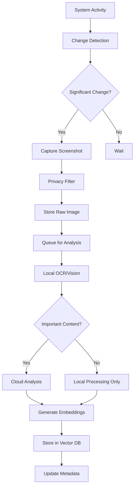
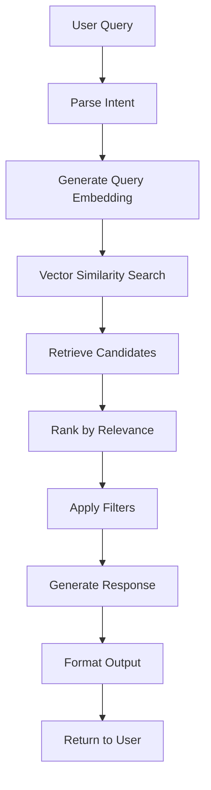
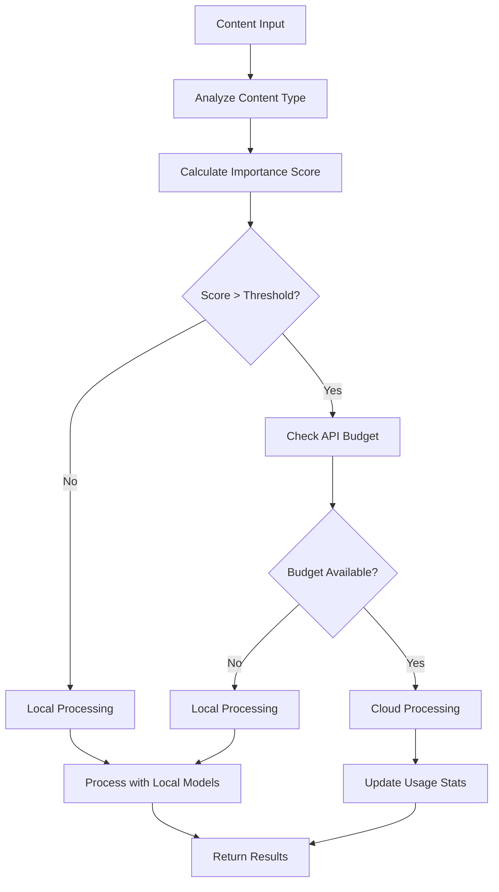

# Eidolon Architecture Overview

This document provides a comprehensive overview of Eidolon's system architecture, design patterns, and architectural decisions.

## 🏗️ System Architecture

### High-Level Architecture

```
┌─────────────────────────────────────────────────────────────┐
│                   External Interfaces                       │
│  Claude Desktop • MCP • REST API • CLI • Web UI            │
└─────────────────────┬───────────────────────────────────────┘
                      │
┌─────────────────────┴───────────────────────────────────────┐
│                  Interface Layer                            │
│  ┌─────────────┐ ┌─────────────┐ ┌─────────────┐           │
│  │     CLI     │ │  REST API   │ │ Chat Engine │           │
│  │   Commands  │ │  Endpoints  │ │   (Chat)    │           │
│  └─────────────┘ └─────────────┘ └─────────────┘           │
└─────────────────────┬───────────────────────────────────────┘
                      │
┌─────────────────────┴───────────────────────────────────────┐
│                   Core Processing Layer                     │
│  ┌─────────────┐ ┌─────────────┐ ┌─────────────┐           │
│  │  Observer   │ │   Analyzer  │ │   Memory    │           │
│  │ (Capture)   │ │ (AI Models) │ │ (Knowledge) │           │
│  └─────────────┘ └─────────────┘ └─────────────┘           │
│  ┌─────────────┐ ┌─────────────┐ ┌─────────────┐           │
│  │Query Proc.  │ │ Insights    │ │ Interface   │           │
│  │ (Search)    │ │ (Analytics) │ │ (API)       │           │
│  └─────────────┘ └─────────────┘ └─────────────┘           │
└─────────────────────┬───────────────────────────────────────┘
                      │
┌─────────────────────┴───────────────────────────────────────┐
│                   AI & Models Layer                         │
│  ┌─────────────┐ ┌─────────────┐ ┌─────────────┐           │
│  │Local Vision │ │ Cloud APIs  │ │ Decision    │           │
│  │ (Florence)  │ │(GPT,Claude) │ │  Engine     │           │
│  └─────────────┘ └─────────────┘ └─────────────┘           │
└─────────────────────┬───────────────────────────────────────┘
                      │
┌─────────────────────┴───────────────────────────────────────┐
│                    Storage Layer                            │
│  ┌─────────────┐ ┌─────────────┐ ┌─────────────┐           │
│  │ Vector DB   │ │ Metadata DB │ │ File System │           │
│  │ (ChromaDB)  │ │  (SQLite)   │ │ (Images)    │           │
│  └─────────────┘ └─────────────┘ └─────────────┘           │
└─────────────────────┬───────────────────────────────────────┘
                      │
┌─────────────────────┴───────────────────────────────────────┐
│                  Infrastructure Layer                       │
│  ┌─────────────┐ ┌─────────────┐ ┌─────────────┐           │
│  │    Config   │ │   Logging   │ │ Monitoring  │           │
│  │ Management  │ │   System    │ │ & Metrics   │           │
│  └─────────────┘ └─────────────┘ └─────────────┘           │
└─────────────────────────────────────────────────────────────┘
```

## 🧩 Core Components

### 1. Observer Layer (`eidolon/core/observer.py`)

**Purpose**: Intelligent screenshot capture and activity monitoring

**Key Features**:
- Smart change detection using computer vision
- Multi-monitor support
- Activity-based capture scheduling
- Privacy-aware content filtering
- Resource-efficient processing

**Architecture**:
```python
class Observer:
    def __init__(self):
        self.capture_engine = CaptureEngine()
        self.change_detector = ChangeDetector()
        self.scheduler = CaptureScheduler()
        self.privacy_filter = PrivacyFilter()
    
    async def start_monitoring(self):
        # Event-driven monitoring loop
        pass
```

**Key Design Patterns**:
- **Observer Pattern**: For event-driven capture
- **Strategy Pattern**: Different capture strategies
- **Chain of Responsibility**: Privacy filtering pipeline

### 2. Analyzer Layer (`eidolon/core/analyzer.py`)

**Purpose**: AI-powered content understanding and analysis

**Key Features**:
- Multi-modal content analysis (vision + text)
- Local and cloud AI model integration
- Intelligent routing based on content importance
- Structured data extraction
- Context-aware processing

**Architecture**:
```python
class AnalysisEngine:
    def __init__(self):
        self.local_models = LocalModelManager()
        self.cloud_apis = CloudAPIManager()
        self.decision_engine = RoutingEngine()
        self.content_processor = ContentProcessor()
    
    async def analyze_content(self, content: Content) -> Analysis:
        # Multi-stage analysis pipeline
        pass
```

**Analysis Pipeline**:
1. **Pre-processing**: Image normalization, text extraction
2. **Local Analysis**: Fast, private analysis using local models
3. **Routing Decision**: Determine if cloud analysis is needed
4. **Cloud Analysis**: Deep analysis using cloud AI APIs
5. **Post-processing**: Combine results, generate insights

### 3. Memory Layer (`eidolon/core/memory.py`)

**Purpose**: Semantic knowledge base and intelligent retrieval

**Key Features**:
- Vector embeddings for semantic search
- Temporal organization of memories
- Contextual relationship mapping
- Multi-modal memory storage
- Efficient retrieval algorithms

**Architecture**:
```python
class MemorySystem:
    def __init__(self):
        self.vector_store = VectorStore()
        self.metadata_store = MetadataStore()
        self.embedding_engine = EmbeddingEngine()
        self.retrieval_engine = RetrievalEngine()
    
    async def store_memory(self, content: Content, metadata: Metadata):
        # Semantic storage pipeline
        pass
```

**Memory Organization**:
- **Hierarchical Structure**: Project → Session → Activity → Content
- **Temporal Indexing**: Time-based organization and decay
- **Semantic Clustering**: Related content grouping
- **Context Graphs**: Relationship mapping between memories

### 4. Query Processor (`eidolon/core/query_processor.py`)

**Purpose**: Natural language query processing and response generation

**Key Features**:
- Natural language understanding
- Query intent classification
- Multi-modal retrieval (text, images, metadata)
- Response generation and formatting
- Context-aware conversations

**Architecture**:
```python
class QueryProcessor:
    def __init__(self):
        self.intent_classifier = IntentClassifier()
        self.retrieval_engine = RetrievalEngine()
        self.response_generator = ResponseGenerator()
        self.conversation_manager = ConversationManager()
    
    async def process_query(self, query: str, context: Context) -> Response:
        # Query processing pipeline
        pass
```

## 🔄 Data Flow Architecture

### Screenshot Capture Flow



### Query Processing Flow



### AI Model Routing Flow



## 🗄️ Database Architecture

### Vector Database (ChromaDB)

**Purpose**: Semantic storage and retrieval of content embeddings

**Schema**:
```python
# Collections
screenshots_collection = {
    "id": str,  # Unique screenshot ID
    "embedding": List[float],  # Content embedding vector
    "metadata": {
        "timestamp": datetime,
        "application": str,
        "window_title": str,
        "content_type": str,
        "importance_score": float,
        "tags": List[str]
    },
    "document": str  # Extracted text content
}

activities_collection = {
    "id": str,  # Activity session ID
    "embedding": List[float],  # Activity summary embedding
    "metadata": {
        "start_time": datetime,
        "end_time": datetime,
        "activity_type": str,
        "productivity_score": float,
        "applications_used": List[str]
    },
    "document": str  # Activity description
}
```

### Metadata Database (SQLite)

**Purpose**: Structured metadata and relationships

**Schema**:
```sql
-- Screenshots table
CREATE TABLE screenshots (
    id TEXT PRIMARY KEY,
    filepath TEXT NOT NULL,
    timestamp DATETIME NOT NULL,
    window_title TEXT,
    application_name TEXT,
    content_hash TEXT,
    analysis_status TEXT,
    importance_score REAL,
    created_at DATETIME DEFAULT CURRENT_TIMESTAMP,
    UNIQUE(content_hash)
);

-- Activities table  
CREATE TABLE activities (
    id TEXT PRIMARY KEY,
    start_time DATETIME NOT NULL,
    end_time DATETIME,
    activity_type TEXT,
    description TEXT,
    productivity_score REAL,
    screenshot_count INTEGER,
    created_at DATETIME DEFAULT CURRENT_TIMESTAMP
);

-- Activity screenshots relationship
CREATE TABLE activity_screenshots (
    activity_id TEXT REFERENCES activities(id),
    screenshot_id TEXT REFERENCES screenshots(id),
    sequence_number INTEGER,
    PRIMARY KEY (activity_id, screenshot_id)
);

-- Analysis results
CREATE TABLE analysis_results (
    id TEXT PRIMARY KEY,
    screenshot_id TEXT REFERENCES screenshots(id),
    analysis_type TEXT NOT NULL,
    result_data JSON,
    confidence_score REAL,
    processing_time REAL,
    created_at DATETIME DEFAULT CURRENT_TIMESTAMP
);

-- User interactions
CREATE TABLE user_interactions (
    id TEXT PRIMARY KEY,
    interaction_type TEXT NOT NULL,
    query_text TEXT,
    results_count INTEGER,
    satisfaction_score REAL,
    timestamp DATETIME DEFAULT CURRENT_TIMESTAMP
);
```

## 🎯 Design Patterns and Principles

### 1. Hexagonal Architecture (Ports and Adapters)

**Implementation**:
- **Core Domain**: Business logic in `eidolon/core/`
- **Ports**: Interfaces in `eidolon/interfaces/`
- **Adapters**: External integrations in `eidolon/adapters/`

**Benefits**:
- Testable business logic
- Pluggable external dependencies
- Clear separation of concerns

### 2. Event-Driven Architecture

**Event System**:
```python
# Event bus for decoupled communication
class EventBus:
    def __init__(self):
        self.handlers = defaultdict(list)
    
    def subscribe(self, event_type: str, handler: Callable):
        self.handlers[event_type].append(handler)
    
    async def publish(self, event: Event):
        for handler in self.handlers[event.type]:
            await handler(event)
```

**Key Events**:
- `ScreenshotCaptured`: New screenshot available
- `ContentAnalyzed`: Analysis complete
- `MemoryStored`: New memory added
- `QueryReceived`: User query submitted
- `ConfigurationChanged`: Settings updated

### 3. Plugin Architecture

**Plugin Interface**:
```python
class Plugin(ABC):
    @abstractmethod
    def initialize(self, config: Config) -> None:
        pass
    
    @abstractmethod
    def process(self, data: Any) -> Any:
        pass
    
    @abstractmethod
    def cleanup(self) -> None:
        pass
```

**Plugin Types**:
- **Capture Plugins**: Custom screenshot sources
- **Analysis Plugins**: Additional AI models
- **Storage Plugins**: Alternative storage backends
- **Interface Plugins**: Custom user interfaces

### 4. Strategy Pattern for AI Models

**Model Strategy Interface**:
```python
class ModelStrategy(ABC):
    @abstractmethod
    async def analyze(self, content: Content) -> Analysis:
        pass
    
    @abstractmethod
    def get_cost(self) -> float:
        pass
    
    @abstractmethod
    def get_capabilities(self) -> List[str]:
        pass
```

**Implementations**:
- `LocalVisionStrategy`: Florence-2, CLIP models
- `OpenAIStrategy`: GPT-4V integration
- `ClaudeStrategy`: Claude-3 integration
- `GeminiStrategy`: Google AI integration

## 🔧 Configuration Architecture

### Hierarchical Configuration

```yaml
# Base configuration
default:
  observer:
    capture_interval: 10
    activity_threshold: 0.05
  
  analysis:
    local_models:
      vision: "microsoft/florence-2-base"
    cloud_apis:
      enabled: true
      cost_limit_daily: 10.0

# Environment-specific overrides
development:
  observer:
    capture_interval: 5  # More frequent for testing
  
  analysis:
    cloud_apis:
      cost_limit_daily: 1.0  # Lower limit for dev

production:
  observer:
    performance_mode: "optimized"
  
  security:
    encryption_enabled: true
```

### Configuration Management

```python
class ConfigManager:
    def __init__(self):
        self.config = self._load_config()
        self.watchers = []
    
    def _load_config(self) -> Config:
        # Load from multiple sources with precedence:
        # 1. Environment variables
        # 2. User config file
        # 3. Default config
        pass
    
    def watch(self, callback: Callable[[Config], None]):
        # Register for configuration changes
        pass
```

## 🚀 Performance Architecture

### Asynchronous Processing

**Core Async Components**:
- Screenshot capture pipeline
- AI model inference
- Database operations
- API request handling

**Implementation**:
```python
async def capture_and_analyze():
    async with asyncio.TaskGroup() as tg:
        capture_task = tg.create_task(capture_screenshot())
        analysis_task = tg.create_task(analyze_previous())
        storage_task = tg.create_task(store_processed())
```

### Caching Strategy

**Multi-Level Caching**:
1. **In-Memory Cache**: Frequently accessed data
2. **Disk Cache**: Processed analysis results
3. **Model Cache**: AI model outputs
4. **Embedding Cache**: Vector embeddings

**Cache Implementation**:
```python
class CacheManager:
    def __init__(self):
        self.memory_cache = LRUCache(maxsize=1000)
        self.disk_cache = DiskCache()
        self.model_cache = ModelCache()
    
    async def get_or_compute(self, key: str, compute_fn: Callable):
        # Multi-level cache lookup with fallback
        pass
```

### Resource Management

**Memory Management**:
- Lazy loading of large models
- Periodic garbage collection
- Memory-mapped file access for large datasets

**CPU Management**:
- Thread pool for CPU-intensive tasks
- Process pool for AI model inference
- Adaptive concurrency based on system load

## 🔒 Security Architecture

### Data Protection

**Encryption at Rest**:
```python
class EncryptedStorage:
    def __init__(self, key: bytes):
        self.cipher = Fernet(key)
    
    def store(self, data: bytes) -> str:
        encrypted = self.cipher.encrypt(data)
        return self._save_to_disk(encrypted)
    
    def retrieve(self, identifier: str) -> bytes:
        encrypted = self._load_from_disk(identifier)
        return self.cipher.decrypt(encrypted)
```

**Privacy Filters**:
```python
class PrivacyFilter:
    def __init__(self, config: PrivacyConfig):
        self.sensitive_patterns = config.sensitive_patterns
        self.excluded_apps = config.excluded_apps
    
    def filter_content(self, content: Content) -> Content:
        # Apply redaction and filtering rules
        pass
```

### Access Control

**Role-Based Access**:
- **Read-Only**: Query and view data
- **Standard**: Normal user operations
- **Admin**: Configuration and management
- **Developer**: Full system access

**API Authentication**:
```python
class APIAuth:
    def __init__(self):
        self.jwt_handler = JWTHandler()
        self.api_key_manager = APIKeyManager()
    
    async def authenticate(self, request: Request) -> User:
        # Multi-factor authentication
        pass
```

## 📊 Monitoring Architecture

### Metrics Collection

**System Metrics**:
- CPU and memory usage
- Disk I/O and storage utilization
- Network bandwidth (for cloud APIs)
- Capture and analysis performance

**Application Metrics**:
- Screenshot capture rate
- Analysis processing time
- Query response time
- User interaction patterns

**Implementation**:
```python
class MetricsCollector:
    def __init__(self):
        self.counters = defaultdict(int)
        self.gauges = defaultdict(float)
        self.histograms = defaultdict(list)
    
    async def record_metric(self, name: str, value: float, tags: Dict[str, str]):
        # Record metric with tags for filtering
        pass
```

### Health Monitoring

**Health Checks**:
- Database connectivity
- AI model availability
- Storage space and permissions
- Network connectivity for cloud services

```python
class HealthMonitor:
    def __init__(self):
        self.checks = {
            'database': self._check_database,
            'storage': self._check_storage,
            'models': self._check_models,
            'network': self._check_network
        }
    
    async def get_health_status(self) -> HealthStatus:
        # Run all health checks
        pass
```

## 🔄 Deployment Architecture

### Container Architecture

**Docker Composition**:
```yaml
version: '3.8'
services:
  eidolon-app:
    build: .
    volumes:
      - ./data:/app/data
      - ./config:/app/config
    environment:
      - EIDOLON_ENV=production
    
  eidolon-worker:
    build: .
    command: python -m eidolon worker
    volumes:
      - ./data:/app/data
    
  vector-db:
    image: chromadb/chroma:latest
    volumes:
      - ./vector_data:/chroma/data
```

### Scalability Considerations

**Horizontal Scaling**:
- Stateless service design
- Database connection pooling
- Load balancing for API endpoints
- Distributed task processing

**Vertical Scaling**:
- Dynamic resource allocation
- Adaptive concurrency limits
- Memory usage optimization
- CPU affinity for AI models

---

This architecture provides a robust, scalable, and maintainable foundation for Eidolon's AI-powered personal assistant capabilities while maintaining security, privacy, and performance requirements.