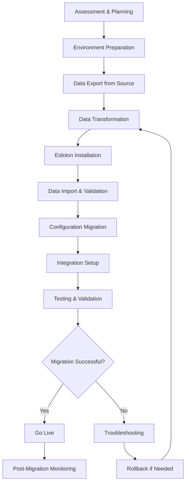

# Eidolon Migration & Upgrade Documentation

This comprehensive guide covers migrating to Eidolon from other systems, upgrading between Eidolon versions, and ensuring smooth transitions while preserving your data and configurations.

## 📚 Table of Contents

### Migration From Other Systems
- **[From RescueTime](from-rescuetime.md)** - Migrate from RescueTime activity tracking
- **[From ManicTime](from-manictime.md)** - Transition from ManicTime monitoring
- **[From Toggl](from-toggl.md)** - Convert Toggl time tracking data
- **[From ActivityWatch](from-activitywatch.md)** - Import ActivityWatch data
- **[From Custom Solutions](from-custom.md)** - Migrate from homebrew monitoring

### Version Upgrades
- **[Upgrade Guide](upgrades/guide.md)** - General upgrade procedures
- **[Version Compatibility](upgrades/compatibility.md)** - Version compatibility matrix
- **[Breaking Changes](upgrades/breaking-changes.md)** - Major version changes
- **[Rollback Procedures](upgrades/rollback.md)** - Safely revert upgrades
- **[Automated Upgrades](upgrades/automated.md)** - Continuous upgrade strategies

### Data Migration
- **[Data Export](data/export.md)** - Export data from source systems
- **[Data Import](data/import.md)** - Import data into Eidolon
- **[Data Transformation](data/transformation.md)** - Convert between data formats
- **[Data Validation](data/validation.md)** - Verify migration accuracy
- **[Large Dataset Migration](data/large-datasets.md)** - Handle enterprise-scale data

### Configuration Migration
- **[Settings Migration](config/settings.md)** - Migrate configuration settings
- **[Custom Rules](config/rules.md)** - Transfer custom monitoring rules
- **[Integration Setup](config/integrations.md)** - Recreate external integrations
- **[Security Configuration](config/security.md)** - Migrate security settings
- **[Performance Optimization](config/performance.md)** - Optimize for new environment

### Migration Planning
- **[Assessment Guide](planning/assessment.md)** - Evaluate current systems
- **[Migration Strategy](planning/strategy.md)** - Plan your migration approach
- **[Risk Management](planning/risks.md)** - Identify and mitigate risks
- **[Testing Procedures](planning/testing.md)** - Validate migration success
- **[Rollout Planning](planning/rollout.md)** - Phased deployment strategies

## 🎯 Quick Migration Scenarios

### Scenario 1: Personal User (RescueTime → Eidolon)

```bash
# 1. Export data from RescueTime
python -m eidolon migrate export-rescuetime \
    --api-key "YOUR_RESCUETIME_API_KEY" \
    --output rescuetime_data.json \
    --date-range "2024-01-01:2025-07-20"

# 2. Install Eidolon
pip install eidolon-ai

# 3. Import RescueTime data
python -m eidolon migrate import-rescuetime \
    --input rescuetime_data.json \
    --merge-strategy "append"

# 4. Verify migration
python -m eidolon migrate validate \
    --source rescuetime_data.json \
    --target eidolon

# 5. Start monitoring
python -m eidolon capture --daemon
```

### Scenario 2: Team Migration (Multiple Systems → Eidolon)

```bash
# 1. Assessment and planning
python -m eidolon migrate assess \
    --systems "rescuetime,toggl,manictime" \
    --users user_list.csv \
    --output assessment_report.pdf

# 2. Bulk data export
python -m eidolon migrate bulk-export \
    --config migration_config.yaml \
    --output-dir ./migration_data

# 3. Staged migration
python -m eidolon migrate staged-import \
    --stage pilot \
    --users pilot_users.csv \
    --data-dir ./migration_data

# 4. Validation and rollout
python -m eidolon migrate validate-stage \
    --stage pilot \
    --report validation_report.pdf
```

### Scenario 3: Enterprise Migration (Legacy → Eidolon Enterprise)

```bash
# 1. Enterprise assessment
python -m eidolon enterprise migrate assess \
    --legacy-system "custom_monitoring" \
    --database "postgresql://legacy_db" \
    --output enterprise_assessment.json

# 2. Pilot deployment
python -m eidolon enterprise deploy pilot \
    --config enterprise_config.yaml \
    --infrastructure pilot_infra.yaml

# 3. Data migration with validation
python -m eidolon enterprise migrate data \
    --source legacy_db \
    --target enterprise_db \
    --validation-level strict \
    --parallel-workers 8

# 4. Configuration migration
python -m eidolon enterprise migrate config \
    --source legacy_config \
    --target enterprise_config \
    --validate-security
```

## 🔄 Migration Process Overview

### Migration Workflow



### Migration Phases

#### Phase 1: Assessment (1-2 days)
- **Current System Evaluation**: Inventory existing monitoring tools
- **Data Volume Assessment**: Measure data to be migrated
- **Integration Mapping**: Identify current integrations
- **Resource Planning**: Estimate migration effort and resources
- **Risk Assessment**: Identify potential migration challenges

#### Phase 2: Preparation (2-3 days)
- **Environment Setup**: Prepare Eidolon infrastructure
- **Data Export**: Extract data from source systems
- **Backup Creation**: Secure backups of all systems
- **Testing Environment**: Set up migration testing environment
- **Tool Preparation**: Install and configure migration tools

#### Phase 3: Migration (1-5 days)
- **Data Transformation**: Convert data to Eidolon format
- **Incremental Import**: Import data in manageable batches
- **Configuration Migration**: Transfer settings and rules
- **Integration Recreation**: Set up external integrations
- **Validation Testing**: Verify data accuracy and completeness

#### Phase 4: Validation (1-2 days)
- **Data Integrity**: Verify all data migrated correctly
- **Functionality Testing**: Test all features and integrations
- **Performance Validation**: Ensure system performance meets requirements
- **User Acceptance**: Validate with end users
- **Security Verification**: Confirm security settings are correct

#### Phase 5: Go-Live (1 day)
- **Final Cutover**: Switch from old system to Eidolon
- **Monitoring Activation**: Start continuous monitoring
- **User Training**: Brief users on changes
- **Support Readiness**: Ensure support team is ready
- **Communication**: Notify all stakeholders of completion

## 📊 Migration Tools & Utilities

### Built-in Migration Tools

```bash
# Assessment tools
eidolon migrate assess --help
eidolon migrate analyze-data --help
eidolon migrate estimate-effort --help

# Export tools
eidolon migrate export-rescuetime --help
eidolon migrate export-toggl --help
eidolon migrate export-activitywatch --help
eidolon migrate export-custom --help

# Import tools
eidolon migrate import-json --help
eidolon migrate import-csv --help
eidolon migrate import-database --help
eidolon migrate import-files --help

# Validation tools
eidolon migrate validate --help
eidolon migrate compare-data --help
eidolon migrate generate-report --help
```

### Custom Migration Scripts

```python
# Example custom migration script
from eidolon.migration import MigrationFramework

class CustomSystemMigrator(MigrationFramework):
    def __init__(self, source_config):
        super().__init__()
        self.source_config = source_config
    
    def extract_data(self):
        """Extract data from custom system"""
        # Custom extraction logic
        pass
    
    def transform_data(self, raw_data):
        """Transform to Eidolon format"""
        # Data transformation logic
        pass
    
    def validate_migration(self):
        """Validate migration success"""
        # Custom validation logic
        pass

# Use the custom migrator
migrator = CustomSystemMigrator(source_config)
migrator.run_migration()
```

### Third-Party Migration Tools

#### Database Migration Tools
- **Flyway**: Database schema migrations
- **Alembic**: Python database migrations
- **Liquibase**: Multi-database migration tool

#### Data Integration Tools
- **Apache Airflow**: Workflow orchestration
- **Talend**: Data integration platform
- **Pentaho**: Data integration and analytics

## 🛠️ Common Migration Scenarios

### RescueTime Migration

#### Data Export from RescueTime
```python
# Export RescueTime data
import requests
from datetime import datetime, timedelta

def export_rescuetime_data(api_key, start_date, end_date):
    url = "https://www.rescuetime.com/anapi/data"
    params = {
        'key': api_key,
        'perspective': 'interval',
        'resolution_time': 'minute',
        'restrict_begin': start_date,
        'restrict_end': end_date,
        'format': 'json'
    }
    
    response = requests.get(url, params=params)
    return response.json()

# Usage
data = export_rescuetime_data(
    api_key="YOUR_API_KEY",
    start_date="2024-01-01",
    end_date="2025-07-20"
)
```

#### Import to Eidolon
```bash
# Transform and import RescueTime data
python -m eidolon migrate import \
    --source rescuetime \
    --input rescuetime_export.json \
    --mapping rescuetime_mapping.yaml \
    --batch-size 1000
```

### Toggl Migration

#### Data Export from Toggl
```python
# Export Toggl time entries
import requests
from base64 import b64encode

def export_toggl_data(api_token, workspace_id):
    auth_header = b64encode(f"{api_token}:api_token".encode()).decode()
    headers = {"Authorization": f"Basic {auth_header}"}
    
    url = f"https://api.track.toggl.com/api/v8/workspaces/{workspace_id}/time_entries"
    response = requests.get(url, headers=headers)
    
    return response.json()
```

### ActivityWatch Migration

#### Data Export from ActivityWatch
```python
# Export ActivityWatch data
import requests
import json

def export_activitywatch_data(aw_server_url):
    # Get buckets
    buckets_response = requests.get(f"{aw_server_url}/api/0/buckets/")
    buckets = buckets_response.json()
    
    # Export data from each bucket
    exported_data = {}
    for bucket_id in buckets.keys():
        events_response = requests.get(
            f"{aw_server_url}/api/0/buckets/{bucket_id}/events"
        )
        exported_data[bucket_id] = events_response.json()
    
    return exported_data
```

## ⚠️ Migration Challenges & Solutions

### Common Challenges

#### 1. **Data Format Incompatibility**
- **Problem**: Source data format doesn't match Eidolon schema
- **Solution**: Use data transformation pipelines
- **Tools**: Custom scripts, ETL tools, mapping configurations

#### 2. **Large Data Volumes**
- **Problem**: Millions of records take too long to migrate
- **Solution**: Batch processing and parallel execution
- **Tools**: Streaming imports, database bulk operations

#### 3. **Data Quality Issues**
- **Problem**: Inconsistent or corrupted source data
- **Solution**: Data cleaning and validation pipelines
- **Tools**: Data profiling, cleansing rules, quality gates

#### 4. **System Downtime**
- **Problem**: Cannot afford system downtime during migration
- **Solution**: Parallel running and gradual cutover
- **Tools**: Blue-green deployment, incremental sync

#### 5. **Configuration Complexity**
- **Problem**: Complex custom rules and configurations
- **Solution**: Configuration mapping and validation
- **Tools**: Configuration analyzers, validation frameworks

### Solution Strategies

#### Incremental Migration
```yaml
# Incremental migration configuration
migration:
  strategy: incremental
  batch_size: 10000
  parallel_workers: 4
  checkpoint_interval: 1000
  
  phases:
    - name: "historical_data"
      date_range: "2024-01-01:2024-12-31"
      priority: low
    
    - name: "recent_data" 
      date_range: "2025-01-01:present"
      priority: high
    
    - name: "configuration"
      type: config_migration
      validate: true
```

#### Parallel Processing
```python
# Parallel migration processing
from concurrent.futures import ThreadPoolExecutor
import threading

class ParallelMigrator:
    def __init__(self, max_workers=4):
        self.max_workers = max_workers
        self.progress = {}
        self.lock = threading.Lock()
    
    def migrate_batch(self, batch_id, data_batch):
        """Migrate a single batch of data"""
        try:
            # Process batch
            result = self.process_batch(data_batch)
            
            # Update progress
            with self.lock:
                self.progress[batch_id] = "completed"
            
            return result
        except Exception as e:
            with self.lock:
                self.progress[batch_id] = f"failed: {e}"
            raise
    
    def run_parallel_migration(self, data_batches):
        """Run migration with parallel processing"""
        with ThreadPoolExecutor(max_workers=self.max_workers) as executor:
            futures = {
                executor.submit(self.migrate_batch, i, batch): i 
                for i, batch in enumerate(data_batches)
            }
            
            for future in futures:
                try:
                    result = future.result()
                    print(f"Batch {futures[future]} completed")
                except Exception as e:
                    print(f"Batch {futures[future]} failed: {e}")
```

## 📋 Migration Checklist

### Pre-Migration Checklist

#### System Assessment
- [ ] Current system inventory completed
- [ ] Data volume and complexity assessed
- [ ] Integration dependencies identified
- [ ] Resource requirements estimated
- [ ] Migration timeline established

#### Environment Preparation
- [ ] Eidolon infrastructure deployed
- [ ] Network connectivity verified
- [ ] Backup systems in place
- [ ] Testing environment ready
- [ ] Migration tools installed

#### Data Preparation
- [ ] Source data exported
- [ ] Data quality assessed
- [ ] Transformation rules defined
- [ ] Mapping configurations created
- [ ] Sample data migration tested

### Migration Execution Checklist

#### During Migration
- [ ] Progress monitoring active
- [ ] Error handling procedures in place
- [ ] Checkpoint/resume capability tested
- [ ] Performance metrics tracked
- [ ] Rollback procedures ready

#### Validation Steps
- [ ] Data integrity verified
- [ ] Record counts match
- [ ] Sample data spot-checked
- [ ] Functionality testing completed
- [ ] Performance benchmarks met

### Post-Migration Checklist

#### Go-Live Preparation
- [ ] System monitoring activated
- [ ] User access configured
- [ ] Integration testing completed
- [ ] Documentation updated
- [ ] Training materials prepared

#### Support Readiness
- [ ] Support team briefed
- [ ] Escalation procedures defined
- [ ] Known issues documented
- [ ] User communication sent
- [ ] Success metrics defined

## 📞 Migration Support

### Support Resources
- **Migration Specialists**: Expert consultation for complex migrations
- **Documentation**: Comprehensive migration guides and tutorials
- **Community Forum**: Peer support and best practices sharing
- **Professional Services**: End-to-end migration assistance

### Support Tiers

#### Community Support (Free)
- Migration documentation and guides
- Community forum support
- Basic migration tools
- Self-service resources

#### Standard Support (Paid)
- Email support for migration issues
- Standard migration tools and utilities
- Documentation and video tutorials
- Response within 48 hours

#### Premium Support (Enterprise)
- Dedicated migration specialist
- Custom migration planning
- Advanced migration tools
- Priority support with 24-hour response
- Post-migration optimization

#### Professional Services (Custom)
- End-to-end migration management
- Custom tool development
- Data quality assurance
- Performance optimization
- Training and knowledge transfer

---

This comprehensive migration documentation ensures successful transitions to Eidolon while preserving data integrity, minimizing downtime, and maximizing the benefits of your new AI-powered personal assistant system.