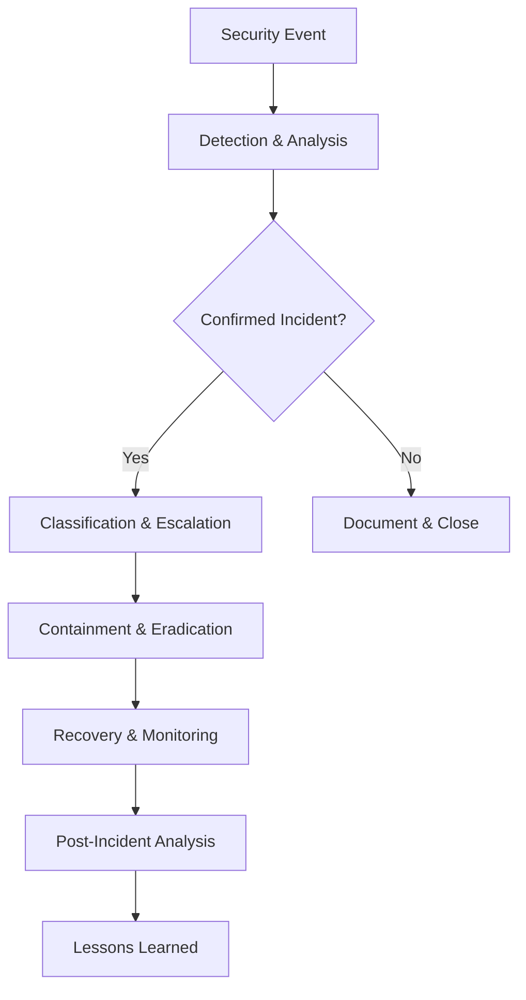

# Eidolon Security & Privacy Documentation

This comprehensive guide covers security, privacy, and compliance aspects of Eidolon AI Personal Assistant. Our security-first approach ensures your digital privacy while providing powerful AI assistance.

## 📚 Table of Contents

### Privacy Protection
- **[Privacy Overview](privacy/overview.md)** - Core privacy principles and guarantees
- **[Data Collection](privacy/data-collection.md)** - What data is collected and why
- **[Data Processing](privacy/data-processing.md)** - How your data is processed and analyzed
- **[Data Storage](privacy/data-storage.md)** - Where and how your data is stored
- **[Data Retention](privacy/data-retention.md)** - Data lifecycle and deletion policies

### Security Architecture
- **[Security Model](security/model.md)** - Overall security architecture and design
- **[Encryption](security/encryption.md)** - Data encryption at rest and in transit
- **[Authentication](security/authentication.md)** - User authentication and access control
- **[Authorization](security/authorization.md)** - Role-based permissions and policies
- **[Network Security](security/network.md)** - Network protection and isolation

### Compliance & Governance
- **[GDPR Compliance](compliance/gdpr.md)** - European data protection compliance
- **[CCPA Compliance](compliance/ccpa.md)** - California privacy law compliance
- **[HIPAA Guidelines](compliance/hipaa.md)** - Healthcare data protection guidelines
- **[SOX Compliance](compliance/sox.md)** - Financial data protection requirements
- **[Data Governance](compliance/governance.md)** - Data handling policies and procedures

### Security Operations
- **[Incident Response](operations/incident-response.md)** - Security incident procedures
- **[Vulnerability Management](operations/vulnerability-mgmt.md)** - Security assessment and patching
- **[Audit & Logging](operations/audit-logging.md)** - Security audit trails and monitoring
- **[Backup Security](operations/backup-security.md)** - Secure backup and recovery procedures
- **[Penetration Testing](operations/penetration-testing.md)** - Security testing and validation

### Configuration & Hardening
- **[Security Configuration](configuration/security-config.md)** - Security settings and hardening
- **[Privacy Controls](configuration/privacy-controls.md)** - User privacy configuration options
- **[Enterprise Security](configuration/enterprise.md)** - Enterprise security features
- **[Threat Modeling](configuration/threat-modeling.md)** - Security risk assessment and mitigation

## 🔒 Security-First Design

### Core Security Principles

#### 1. **Privacy by Design**
- Data minimization - collect only what's necessary
- Purpose limitation - use data only for stated purposes
- Storage limitation - retain data only as long as needed
- Transparency - clear communication about data practices

#### 2. **Zero-Trust Architecture**
- Verify everything, trust nothing
- Least privilege access
- Continuous monitoring and validation
- Assume breach mentality

#### 3. **Defense in Depth**
- Multiple layers of security controls
- Fail-safe defaults
- Complete mediation
- Economy of mechanism

#### 4. **Secure by Default**
- Strongest security settings enabled by default
- Opt-in for data sharing
- Automatic security updates
- Proactive threat detection

## 🛡️ Privacy Guarantees

### What We Protect

#### Personal Information
- **Screen Content**: All captured screenshots and extracted text
- **Activity Patterns**: Your work habits and productivity data
- **Search History**: Your queries and interaction patterns
- **Metadata**: Application usage, timing, and behavioral data

#### Sensitive Data Categories
- **Financial Information**: Banking, credit card, financial documents
- **Health Information**: Medical records, health apps, fitness data
- **Authentication Data**: Passwords, API keys, authentication tokens
- **Personal Communications**: Private messages, emails, personal documents

### How We Protect It

#### Local-First Processing
```yaml
# Default privacy configuration
privacy:
  local_first: true              # Process locally when possible
  cloud_opt_in: false           # Require explicit consent for cloud
  sensitive_detection: true     # Auto-detect sensitive content
  redaction_enabled: true       # Auto-redact sensitive patterns
  
  excluded_applications:
    - "1Password"
    - "Keychain Access" 
    - "Banking Apps"
    - "Private Browsing"
  
  sensitive_patterns:
    - "password"
    - "social security"
    - "credit card"
    - "api_key"
    - "token"
```

#### Encryption Standards
- **AES-256 encryption** for data at rest
- **TLS 1.3** for data in transit
- **End-to-end encryption** for cloud communications
- **Key derivation** using PBKDF2 with 100,000 iterations

#### Data Isolation
- **Process isolation** for sensitive operations
- **Memory protection** with secure allocation
- **Network isolation** for local processing
- **Filesystem permissions** with restricted access

## 🔐 Security Architecture

### System Security Model

```
┌─────────────────────────────────────────────────────────────┐
│                    Security Perimeter                       │
│  ┌─────────────┐ ┌─────────────┐ ┌─────────────┐           │
│  │  Firewall   │ │     WAF     │ │    IDS/IPS  │           │
│  │ Protection  │ │ Protection  │ │ Monitoring  │           │
│  └─────────────┘ └─────────────┘ └─────────────┘           │
└─────────────────────┬───────────────────────────────────────┘
                      │
┌─────────────────────┴───────────────────────────────────────┐
│                Application Security                         │
│  ┌─────────────┐ ┌─────────────┐ ┌─────────────┐           │
│  │    Auth     │ │   Input     │ │   Output    │           │
│  │ Validation  │ │ Validation  │ │ Filtering   │           │
│  └─────────────┘ └─────────────┘ └─────────────┘           │
└─────────────────────┬───────────────────────────────────────┘
                      │
┌─────────────────────┴───────────────────────────────────────┐
│                   Data Security                             │
│  ┌─────────────┐ ┌─────────────┐ ┌─────────────┐           │
│  │ Encryption  │ │ Access      │ │ Audit       │           │
│  │ at Rest     │ │ Control     │ │ Logging     │           │
│  └─────────────┘ └─────────────┘ └─────────────┘           │
└─────────────────────┬───────────────────────────────────────┘
                      │
┌─────────────────────┴───────────────────────────────────────┐
│                Infrastructure Security                      │
│  ┌─────────────┐ ┌─────────────┐ ┌─────────────┐           │
│  │  OS/Host    │ │  Container  │ │   Network   │           │
│  │ Hardening   │ │  Security   │ │ Isolation   │           │
│  └─────────────┘ └─────────────┘ └─────────────┘           │
└─────────────────────────────────────────────────────────────┘
```

### Security Controls by Layer

#### Application Layer
- **Authentication**: Multi-factor authentication, API keys
- **Authorization**: Role-based access control (RBAC)
- **Input Validation**: SQL injection, XSS prevention
- **Session Management**: Secure session handling
- **Rate Limiting**: DDoS and abuse prevention

#### Data Layer
- **Encryption**: AES-256 for sensitive data
- **Access Control**: Principle of least privilege
- **Data Classification**: Automatic sensitivity detection
- **Audit Trails**: Comprehensive activity logging
- **Backup Security**: Encrypted, tested backups

#### Infrastructure Layer
- **OS Hardening**: Minimal attack surface
- **Container Security**: Runtime protection, image scanning
- **Network Security**: Firewalls, VPNs, network segmentation
- **Monitoring**: Real-time threat detection
- **Patch Management**: Automated security updates

## 📋 Compliance Framework

### GDPR Compliance

#### Data Subject Rights
- **Right to Information**: Clear privacy notices
- **Right of Access**: Export personal data
- **Right to Rectification**: Correct inaccurate data
- **Right to Erasure**: Delete personal data
- **Right to Data Portability**: Transfer data to other services

#### Implementation
```python
# GDPR compliance features
class GDPRCompliance:
    def request_data_export(self, user_id: str) -> DataExport:
        """Export all user data in machine-readable format"""
        pass
    
    def request_data_deletion(self, user_id: str) -> DeletionResult:
        """Permanently delete all user data"""
        pass
    
    def update_consent(self, user_id: str, consent: ConsentRecord):
        """Update user consent preferences"""
        pass
```

### CCPA Compliance

#### Consumer Rights
- **Right to Know**: What personal information is collected
- **Right to Delete**: Request deletion of personal information
- **Right to Opt-Out**: Opt-out of sale of personal information
- **Right to Non-Discrimination**: Equal service regardless of privacy choices

### HIPAA Guidelines

#### Healthcare Data Protection
- **Covered Entities**: Healthcare providers, plans, clearinghouses
- **Business Associates**: Service providers handling PHI
- **Safeguards**: Administrative, physical, and technical safeguards
- **Breach Notification**: Prompt notification of data breaches

## 🚨 Incident Response

### Security Incident Classification

#### Severity Levels
1. **Critical**: Data breach, system compromise, service outage
2. **High**: Unauthorized access, malware detection, significant vulnerability
3. **Medium**: Policy violations, minor security issues
4. **Low**: Security awareness, routine maintenance

#### Response Timeline
- **Critical**: 1 hour detection, 4 hours containment
- **High**: 4 hours detection, 24 hours containment
- **Medium**: 24 hours detection, 72 hours resolution
- **Low**: 72 hours detection, 1 week resolution

### Incident Response Process



## 🔍 Security Monitoring

### Continuous Monitoring

#### Real-time Threat Detection
- **Behavioral Analytics**: Anomaly detection in user patterns
- **File Integrity Monitoring**: Changes to critical system files
- **Network Traffic Analysis**: Suspicious network communications
- **Log Analysis**: Security event correlation and analysis

#### Security Metrics
```yaml
security_metrics:
  authentication:
    failed_logins_threshold: 5
    suspicious_patterns: true
    account_lockout_duration: 30m
  
  data_access:
    unusual_access_patterns: true
    bulk_data_extraction: true
    off_hours_access: true
  
  system_integrity:
    file_modifications: true
    privilege_escalations: true
    unauthorized_processes: true
```

### Audit Logging

#### Security Events Logged
- Authentication attempts (success/failure)
- Authorization decisions
- Data access and modifications
- Configuration changes
- Administrative actions
- System errors and exceptions

#### Log Format
```json
{
  "timestamp": "2025-07-20T10:30:00Z",
  "event_type": "authentication",
  "severity": "info",
  "user_id": "user123",
  "source_ip": "192.168.1.100",
  "user_agent": "EidolonApp/1.0",
  "action": "login_success",
  "metadata": {
    "session_id": "session456",
    "mfa_used": true,
    "location": "San Francisco, CA"
  }
}
```

## ⚙️ Security Configuration

### Essential Security Settings

```yaml
# ~/.eidolon/config/security.yaml
security:
  # Authentication
  authentication:
    mfa_required: true
    session_timeout: 8h
    password_policy:
      min_length: 12
      require_special_chars: true
      require_numbers: true
      require_uppercase: true
  
  # Encryption
  encryption:
    algorithm: "AES-256-GCM"
    key_rotation_days: 90
    encrypt_at_rest: true
    encrypt_in_transit: true
  
  # Access Control
  access_control:
    default_permissions: "read_only"
    admin_approval_required: true
    session_concurrency_limit: 3
  
  # Privacy
  privacy:
    automatic_redaction: true
    consent_required: true
    data_retention_days: 365
    anonymization_enabled: true
```

### Privacy Controls

```yaml
# User privacy preferences
privacy_controls:
  data_collection:
    screenshots: true
    text_content: true
    application_usage: true
    keyboard_activity: false
  
  data_sharing:
    cloud_analysis: false
    anonymized_telemetry: true
    research_participation: false
  
  retention:
    automatic_cleanup: true
    retention_period: "1_year"
    backup_retention: "7_years"
```

## 🎯 Security Best Practices

### For Users

#### Personal Security
1. **Use Strong Authentication**: Enable MFA, use strong passwords
2. **Regular Updates**: Keep Eidolon updated with latest security patches
3. **Privacy Settings**: Review and configure privacy controls
4. **Data Monitoring**: Regularly review captured data
5. **Secure Environment**: Use Eidolon on trusted, secured devices

#### Data Protection
1. **Sensitive Data**: Configure exclusions for sensitive applications
2. **Local Processing**: Prefer local-only mode for sensitive work
3. **Regular Cleanup**: Periodically clean old data
4. **Backup Security**: Ensure backups are encrypted and secure
5. **Network Security**: Use secure networks, avoid public WiFi

### For Administrators

#### System Hardening
1. **Minimal Installation**: Install only required components
2. **Regular Patching**: Automated security updates
3. **Access Control**: Implement principle of least privilege
4. **Network Segmentation**: Isolate Eidolon from sensitive systems
5. **Monitoring**: Continuous security monitoring and alerting

#### Compliance Management
1. **Policy Enforcement**: Implement and enforce security policies
2. **Audit Preparation**: Regular compliance audits and assessments
3. **Incident Planning**: Maintain updated incident response plans
4. **Training**: Security awareness training for all users
5. **Documentation**: Maintain current security documentation

## 📞 Security Support

### Reporting Security Issues

#### Responsible Disclosure
- **Security Email**: security@eidolon-ai.com
- **PGP Key**: Available on our website
- **Response Time**: 24 hours acknowledgment
- **Disclosure Timeline**: 90 days coordinated disclosure

#### Bug Bounty Program
- **Scope**: Eidolon core application and infrastructure
- **Rewards**: $100 - $10,000 based on severity
- **Requirements**: Responsible disclosure, no data access
- **Platform**: HackerOne vulnerability platform

### Security Resources

#### Documentation
- Security architecture documentation
- Threat modeling and risk assessments
- Security configuration guides
- Incident response procedures

#### Training
- Security awareness training modules
- Privacy protection best practices
- Incident response simulation exercises
- Compliance training programs

---

This comprehensive security documentation ensures that Eidolon provides enterprise-grade security while maintaining user privacy and regulatory compliance across all deployment scenarios.